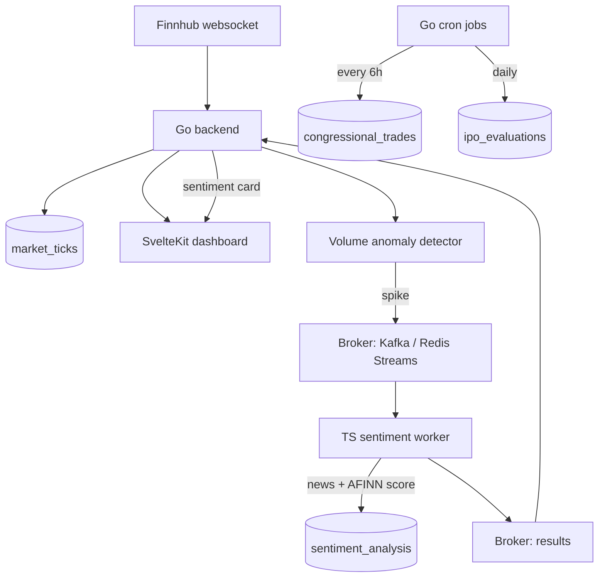

# Watchtower

Watchtower is a live, event-driven market intelligence platform. It streams real-time stock prices, automatically flags unusual trading activity, and explains each spike with news sentiment - all on screen within seconds, no refresh. It also tracks US congressional stock disclosures and scores upcoming IPOs by risk.

## What it does

- **Live dashboard** - real-time price charts streamed over a websocket, with a watchlist you can add to or remove from (up to 25 tickers, saved in your browser). When the market is closed it shows the last close and the day's stats.
- **Robinhood-style ranges** - per-symbol `1H / 1D / 1W / YTD / 1Y / 5Y / MAX` tabs, with the percentage and line color reflecting the selected window.
- **Anomaly + sentiment pipeline** - a detector watches the tick stream and fires when volume blows past its recent average. The moment it does, a worker pulls that ticker's recent news, scores the headlines, and a sentiment card fills in on the dashboard automatically.
- **Congressional trades** - recent House/Senate disclosures per ticker, with buy/sell breakdowns.
- **IPO risk rater** - upcoming IPOs scored 0-100, and each row opens a modal explaining exactly how the score was calculated.

## Two ways to run it

The same codebase runs in two configurations, chosen by environment variables - so you get the full "real" architecture locally and a $0 hosted version on the web. No features differ between them.

### 1. Locally (full stack)

Runs the real infrastructure: **Apache Kafka** as the message broker and **TimescaleDB** for tick storage, via Docker.

```bash
cp .env.example .env        # add your free Finnhub API key
make up                     # start TimescaleDB + Redis + Kafka + Zookeeper
make backend                # Go API + websocket server
make worker                 # TypeScript sentiment worker
make frontend               # SvelteKit dev server
```

Then open the printed local URL (the SvelteKit dev server). Grab a free Finnhub key at [finnhub.io](https://finnhub.io) - no card required.

### 2. On the web (free hosting)

For a public deployment there's no free managed Kafka and no free Postgres with the TimescaleDB extension, so the hosted build swaps in **Redis Streams** (as the broker) and **plain Postgres** (Neon). It's selected purely with `BROKER=redis`; everything else is identical.

Full step-by-step walkthrough - Neon, Upstash, Render, Cloudflare Pages/Netlify, UptimeRobot - is in [DEPLOY.md](DEPLOY.md). All of it fits on permanent free tiers.

## Tech stack

- **Backend:** Go (Gin, pgx/v5, gorilla/websocket, go-redis, IBM/sarama)
- **Sentiment worker:** TypeScript / Node.js (kafkajs or ioredis, `sentiment` AFINN scoring, pg)
- **Frontend:** SvelteKit + Tailwind CSS + Lightweight Charts
- **Data:** TimescaleDB / PostgreSQL, Redis
- **Messaging:** Apache Kafka (local) or Redis Streams (hosted)
- **Infra:** Docker / Docker Compose

## How it fits together



The tick stream feeds the live charts, the database, and the anomaly detector at once. When the detector fires, the spike goes through the broker to the sentiment worker, which scores the news and sends a result back through the broker; the backend pushes that to the browser over the same websocket. Congressional trades and the IPO calendar are filled by separate background jobs.

## Project layout

```
Watchtower/
├── docker-compose.yml        # local infra: TimescaleDB, Redis, Kafka, Zookeeper
├── render.yaml               # hosted build: backend + worker on Render
├── Makefile                  # make up / backend / worker / frontend / migrate
├── DEPLOY.md                 # free-hosting walkthrough
├── db/migrations/            # schema (TimescaleDB locally, plain Postgres in prod)
├── backend/                  # Go API, websocket hub, anomaly detector, cron jobs
│   └── internal/broker/      # broker interface + Kafka and Redis Streams impls
├── sentiment-worker/         # TypeScript worker (broker-agnostic)
└── frontend/                 # SvelteKit app (static build for hosting)
```

## Notes

- Live prices only stream during US market hours; outside them the dashboard shows the last close.
- The Finnhub free tier (60 REST calls/min, 50 websocket symbols) is respected via a Redis sliding-window rate limiter and a per-IP limit on the public API.
